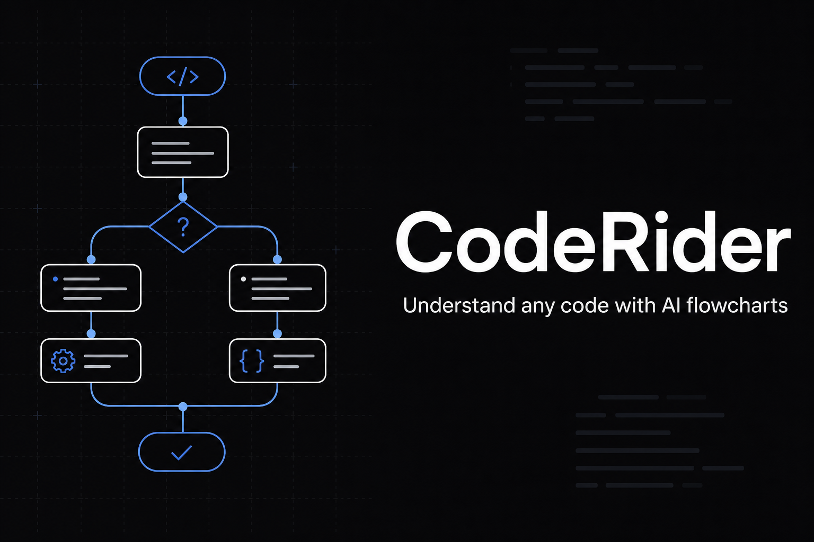

# CodeRider

AI-powered visual code workspace manager for developers who want to understand codebases through flowcharts and logic explanations.

**Live demo:** [https://coderider.vercel.app](https://coderider.vercel.app)



## How it works

1. **Open or paste code** — load a local folder or use Quick Paste mode
2. **Click Analyze** — AI scans the logic and architecture
3. **See the diagram** — Mermaid flowchart + plain-English explanation

## Tech Stack

- **Framework:** Next.js (App Router) + TypeScript
- **Styling:** Tailwind CSS v4 + shadcn/ui
- **AI:** Google Gemini 1.5 Flash
- **Auth:** Clerk
- **Deploy:** Vercel

## Getting Started

```bash
npm install
cp .env.example .env.local
npm run dev
```

Open [http://localhost:3000](http://localhost:3000) in your browser.

### Environment variables

Copy `.env.example` to `.env.local` and fill in:

| Variable | Required | Description |
|----------|----------|-------------|
| `GEMINI_API_KEY` | Yes | Google AI Studio API key |
| `NEXT_PUBLIC_CLERK_PUBLISHABLE_KEY` | For auth | Clerk publishable key |
| `CLERK_SECRET_KEY` | For auth | Clerk secret key |
| `NEXT_PUBLIC_CLERK_SIGN_IN_URL` | Yes | `/sign-in` |
| `NEXT_PUBLIC_CLERK_SIGN_UP_URL` | Yes | `/sign-up` |
| `NEXT_PUBLIC_CLERK_AFTER_SIGN_IN_URL` | Yes | `/workspace` |
| `NEXT_PUBLIC_CLERK_AFTER_SIGN_UP_URL` | Yes | `/workspace` |
| `NEXT_PUBLIC_SITE_URL` | Optional | Production URL for SEO metadata |
| `NEXT_PUBLIC_SUPABASE_URL` | For history + billing | Supabase project URL |
| `SUPABASE_SERVICE_ROLE_KEY` | For history + billing | Server-side only — never expose to client |
| `STRIPE_SECRET_KEY` | For billing | Stripe secret key |
| `STRIPE_PRICE_ID` | For billing | Pro subscription price ID |
| `STRIPE_WEBHOOK_SECRET` | For billing | Stripe webhook signing secret |
| `NEXT_PUBLIC_STRIPE_PUBLISHABLE_KEY` | Optional | Stripe publishable key |

Without Clerk keys, the app runs in open demo mode (workspace and analyze are accessible).

Full production setup: [docs/deploy-production.md](./docs/deploy-production.md)

## Project Structure

```
app/                  # Next.js App Router pages
components/
  ui/                 # shadcn/ui components
  workspace/          # IDE workspace components
lib/                  # Utilities
```

## MVP Roadmap

- [x] Next.js + 3-column workspace layout
- [x] Local folder ingestion (File System API)
- [x] Code viewer + Shiki syntax highlighting
- [x] Gemini AI analysis pipeline
- [x] Mermaid diagram rendering
- [x] Quick paste snippet mode
- [x] Clerk authentication
- [x] Guardrails, loading UX, and error handling
- [x] Production deployment (Vercel)
- [x] Launch polish (SEO, privacy, landing)
- [x] Marketing kit + launch playbook (`docs/launch/`)
- [x] AI Tutor / Guide Me learning path
- [x] AI Chat with history + code highlighting
- [x] Free-tier usage limits + Stripe billing
- [x] **10-day MVP complete** — see [docs/MVP_COMPLETE.md](./docs/MVP_COMPLETE.md)

## Production

- **URL:** [https://coderider.vercel.app](https://coderider.vercel.app)
- **Repo:** [github.com/sandaru-fx/SaaS_Code_Reader](https://github.com/sandaru-fx/SaaS_Code_Reader)
- **Privacy:** [coderider.vercel.app/privacy](https://coderider.vercel.app/privacy)

To enable auth on production, add Clerk API keys in Vercel environment variables and allow `coderider.vercel.app` in the Clerk dashboard.

For billing (usage limits + Stripe), also set Supabase and Stripe env vars and run migrations — see [docs/deploy-production.md](./docs/deploy-production.md).

## Launch kit

Copy-paste marketing content for social posts and Product Hunt: [`docs/launch/`](./docs/launch/)

## Scripts

```bash
npm run dev      # Start development server
npm run build    # Production build
npm run lint     # ESLint
```
